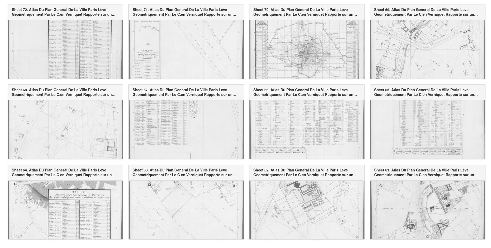

**Coordinators:** Julien Perret, Bertrand Duménieu

**Member:** Melvin Hersent

The SODUCO metadata catalog aim to store and reference archival records and digital data used and produced throughout the project with an open-source solution :

## The stored data

The catalog will store data depending on their disponibility online : By linking them to existing ressources already online or by hosting them locally otherwise.

|  |
|:--:|
| Scans of the Verniquet atlas, coming from the [David Rumsey Map Collection](https://www.davidrumsey.com/) |

Services used to produce or using data will also be listed on the catalog.

The final aim is to make the production line transparent for each ressource by connecting each step between them, with the tools used, to not only store the data but also their history and context of production, with the goal of reproducibility in mind.

To do so, the metadata are essentials.

## The metadata model

The metadata model used on the SODUCO project is the ISO 19115 standard, which is natively implemented in Geonetwork.

As defined on its [webpage](https://www.iso.org/standard/53798.html), this standard :

- > defines the schema required for describing geographic information and services by means of metadata. It provides information about the identification, the extent, the quality, the spatial and temporal aspects, the content, the spatial reference, the portrayal, distribution, and other properties of digital geographic data and services.
- > is applicable to:
  >  
  > - the cataloguing of all types of resources, clearinghouse activities, and the full description of datasets and services;
  > - geographic services, geographic datasets, dataset series, and individual geographic features and feature properties.
