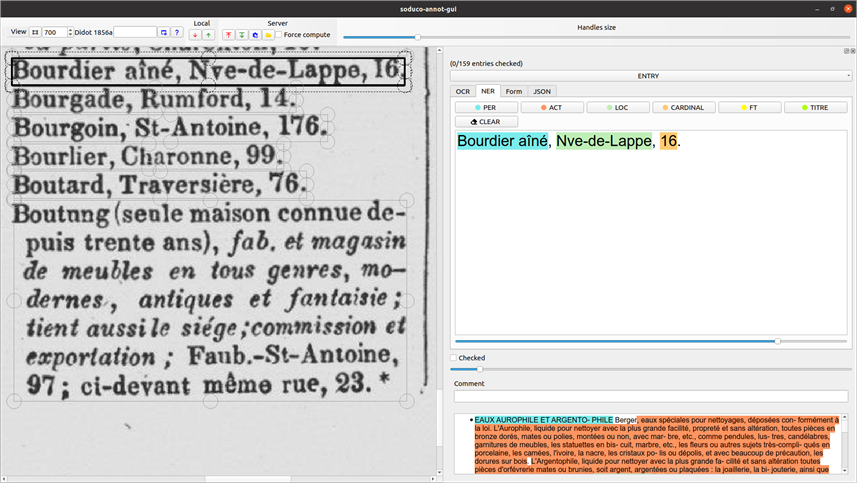
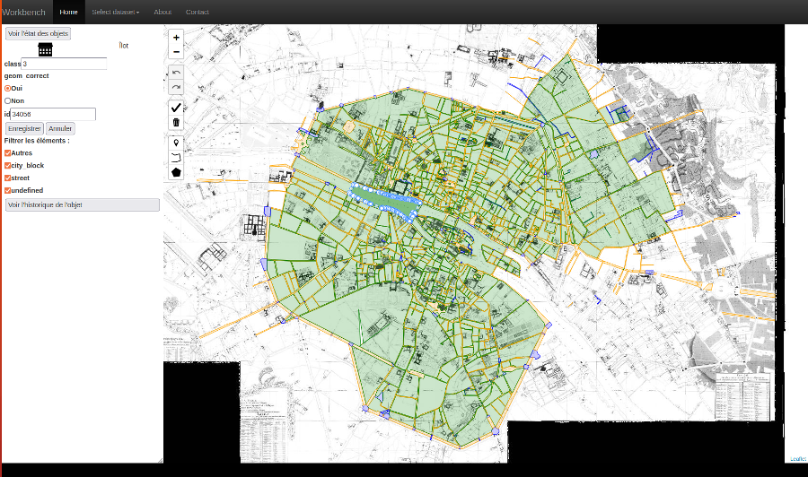
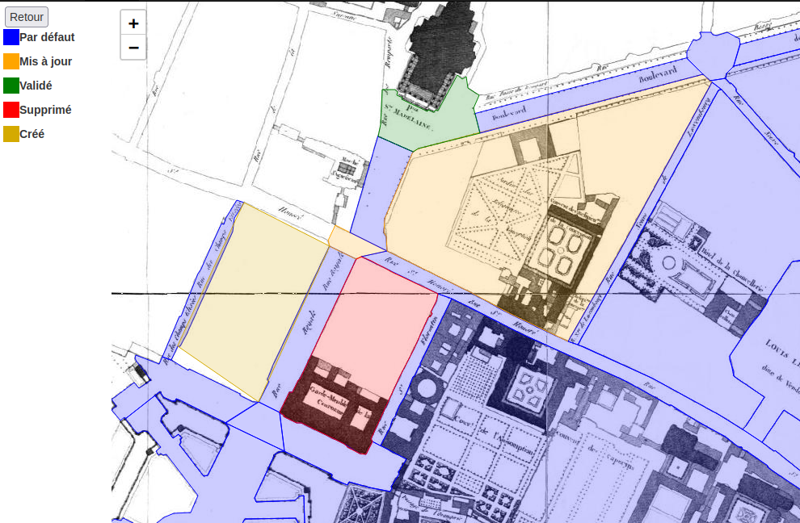

## Publications and talks

### International conference papers

Nathalie Abadie, Edwin Carlinet, Joseph Chazalon, and Bertrand Dumenieu. A Benchmark of Named Entity Recognition Approaches in Historical Documents Application to 19 Century French Directories. *In: Uchida, S., Barney, E., Eglin, V. (eds) Document Analysis Systems. DAS 2022*. Lecture Notes in Computer Science, vol 13237. Springer, Cham. Proceedings of the Document Analysis Systems international workshop, held in La Rochelle, France, 22-25 may 2022. [⟨10.1007/978-3-031-06555-2_30⟩](https://doi.org/10.1007/978-3-031-06555-2_30).
[Code for the paper]( https://github.com/soduco/paper-ner-bench-das22.)

Yizi Chen, Edwin Carlinet, Joseph Chazalon, Clément Mallet, Bertrand Duménieu, et al.. Combining Deep Learning and Mathematical Morphology for Historical Map Segmentation. *Discrete Geometry and Mathematical Morphology, First International Joint Conference, DGMM 2021, Uppsala, Sweden, May 24–27, 2021, Proceedings*, 12708, pp 79 - 92, 2021, Lecture notes in computer science, [⟨10.1007/978-3-030-76657-3_5⟩](https://dx.doi.org/10.1007/978-3-030-76657-3_5). [⟨hal-03101578⟩](https://hal.archives-ouvertes.fr/hal-03101578)
[Code for the paper](https://github.com/soduco/paper-dgmm2021)

Yizi Chen, Edwin Carlinet, Joseph Chazalon, Clément Mallet, Bertrand Dumenieu, et al.. Vectorization of historical maps using deep edge filtering and closed shape extraction. *16th International Conference on Document Analysis and Recognition (ICDAR'21)*, Sep 2021, Lausanne, Switzerland. pp.510-525, [⟨10.1007/978-3-030-86337-1_34⟩](https://dx.doi.org/10.1007/978-3-030-86337-1_34). [⟨hal-03256073⟩](https://hal.archives-ouvertes.fr/hal-03256073)
[Code for the paper](https://github.com/soduco/ICDAR-2021-Vectorization)

Bertrand Dumenieu, Julien Chadeyron, Pascal Cristofoli, Julien Perret, Laurence Jolivet, et al.. Engraved footprints from the past. Retrieving cartographic geohistorical data from the Cassini Carte de France, 1750-1789. *International Cartographic Conference 2019*, Jul 2019, Tokyo, Japan. [⟨hal-02173847⟩](https://hal.archives-ouvertes.fr/hal-02173847)

## Datasets, benchmarks and other resources

### Benchmark dataset for NER models used on noisy OCR predictions

 A benchmark dataset for NER models and noisy OCR predictions has been created based on our corpus of directories and is freely available:
- suitable for OCR evaluation,
- suitable for NER fine-tuning self-supervised and supervised,
- suitable for NER evaluation.

8, 765 reference entries from a selection of directories were manually corrected and annotated with 34, 242 entities. Entries contain 3.9 entities on average.
Reference tagged entities were then projected on OCR predictions done by tree different OCR systems. This resulted in a variable loss of entries:
- for PERO OCR: 8, 392 valid entries were generated, 
- for Tesseract: 8, 700 valid entries were generated, 
- for Kraken: 7, 990 valid entries were generated. 

The resulting intersection of the sets of valid entries contains 7, 725 entries for the tree OCR systems (and the reference), or 8, 341 entries if we consider PERO OCR and Tesseract only.

The dataset is described in more detail and can be dowloaded at https://zenodo.org/record/6394464

### Benchmark dataset for historical maps segmentation

A benchmark dataset for historical maps segmentation has been created and used to organise a commetition at the ICDAR 2021 conference: https://icdar21-mapseg.github.io/

## Tools

### Semi-automatic annotation tool

A semi-automatic text annotation tool is developped by the project. It takes PDF documents as input and processes them automatically by applying the three following steps:
- layout detection,
- optical characters recognition (with PERO OCR),
- named entities recognition (fine-tuned CamemBERT model).

Users can then check and manually correct each automatically detected and processed text section.

|  |
|:--:|
| <b>The trade directories from the 19th century are a challenging dataset with very heterogeneous layouts, fonts, and contents. Source: gallica.bnf.fr / Bibliothèque nationale de France</b>|

|  |
|:--:|
| <b>SODUCO text annotation tool</b>|

### Geohistorical geocoding tool

Add a description here.

|  |
|:--:|
| <b>Caption for the image</b>|

### Old maps vectorisation tool

Add a description here.

|  |
|:--:|
| <b>Caption for the image</b>|

### Vector data validation and correction tool

A collaborative tool to validate and edit geospatial data and more is developped to improve data quality by getting a human validation of any type of geospatial data. It allows users to improve this quality by creating, removing, modifying or validating any feature (geometry and attributes).

|  |  |
|:--:|:--:|
| <b>General view of the tool with uploaded data</b>|<b>Edit mode, creation of the geometry of a new feature</b>|

|  |  |
|:--:| :--:|
| <b>Edit mode, change of attributes of an existing feature</b>|<b>Status mode to see what features were created, removed or modified</b>|

### Data and historical sources catalogue

A [catalog](https://soduco.github.io/catalog/) has been developped to store, reference and retrieve archival records and digital data used and produced throughout the project.

|  |
|:--:|
| <b>SODUCO catalog</b>|
